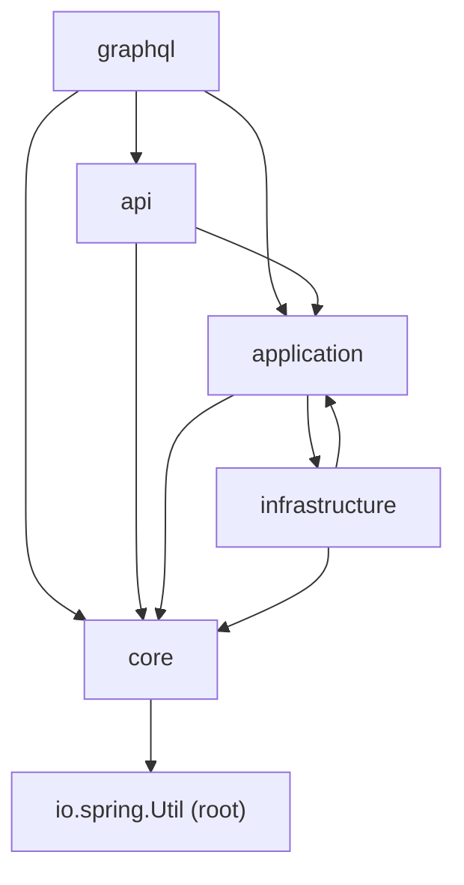

# Package Dependency Analysis

Scope: all `import io.spring.*` statements under `src/main/java`, aggregated at top-level
package granularity (`api`, `graphql`, `application`, `core`, `infrastructure`, plus the root
package `io.spring` itself). Sub-packages (`api.exception`, `api.security`, `application.data`,
`graphql.types`, `infrastructure.mybatis.readservice`, ...) are collapsed into their top-level
module, and edges within a module are ignored.

## 1. Package dependency graph



ASCII form:

```
graphql ──────────────┐
   │  │  │            │  (only io.spring.api.exception types)
   │  │  └──────────► api
   │  │                 │
   │  └───────────────┐ │
   │                  ▼ ▼
   │             application ◄──────┐
   │                  │  ▲          │
   │                  │  └──────────┤  cycle
   │                  └────────► infrastructure
   │                                │
   └──────────────► core ◄──────────┘
                      │
                      ▼
                io.spring.Util (root)
```

Edge detail:

| Edge | Nature | Representative sources |
| --- | --- | --- |
| `graphql -> api` | Shared exception/error types only (`io.spring.api.exception`: `FieldErrorResource`, `InvalidAuthenticationException`, `NoAuthorizationException`, `ResourceNotFoundException`) | `ArticleMutation.java`, `CommentMutation.java`, `graphql/exception/GraphQLCustomizeExceptionHandler.java`, `ArticleDatafetcher.java`, `MeDatafetcher.java`, `ProfileDatafetcher.java`, `RelationMutation.java`, `UserMutation.java` |
| `graphql -> application` | Query services, command params, read-model DTOs, pagination helpers | `ArticleDatafetcher.java`, `CommentDatafetcher.java`, `MeDatafetcher.java`, `TagDatafetcher.java`, `UserMutation.java` |
| `graphql -> core` | Domain entities and domain services | `ArticleMutation.java`, `RelationMutation.java`, `SecurityUtil.java` |
| `api -> application` | Query/command services, params, read-model DTOs, `Page` | `ArticleApi.java`, `ArticlesApi.java`, `CommentsApi.java`, `CurrentUserApi.java`, `UsersApi.java` |
| `api -> core` | Domain entities, repositories, `AuthorizationService`, `JwtService` | `ArticleApi.java`, `ProfileApi.java`, `api/security/JwtTokenFilter.java` |
| `application -> infrastructure` | Query services depend on `infrastructure.mybatis.readservice.*` interfaces | `ArticleQueryService.java`, `CommentQueryService.java`, `ProfileQueryService.java`, `TagsQueryService.java`, `UserQueryService.java` |
| `application -> core` | Domain entities and repositories | `article/ArticleCommandService.java`, `user/UserService.java` |
| `infrastructure -> application` | Read-service interfaces depend on `application.data.*`, `application.Page`, `application.CursorPageParameter` | `readservice/ArticleReadService.java`, `readservice/CommentReadService.java`, `readservice/ArticleFavoritesReadService.java`, `readservice/UserReadService.java` |
| `infrastructure -> core` | Repository implementations and JWT service | `repository/MyBatis*Repository.java`, `service/DefaultJwtService.java` |
| `core -> io.spring.Util` | Root-package utility only | `core/article/Article.java`, `core/user/User.java` |

## 2. Fan-in / fan-out

| Package | Fan-in (incoming) | Fan-out (outgoing) | Depends on |
| --- | --- | --- | --- |
| `core` | 4 (`api`, `graphql`, `application`, `infrastructure`) | 1 | `io.spring` root (`Util`) |
| `application` | 3 (`graphql`, `api`, `infrastructure`) | 2 | `infrastructure`, `core` |
| `api` | 1 (`graphql`) | 2 | `application`, `core` |
| `infrastructure` | 1 (`application`) | 2 | `application`, `core` |
| `graphql` | 0 | 3 | `api`, `application`, `core` |

- Highest fan-in: `core` (4), then `application` (3).
- Highest fan-out: `graphql` (3) — it reaches into `api`, `application` and `core`.
- `api`, `application` and `infrastructure` each have fan-out 2; `graphql` is a pure entrypoint
  with no incoming dependencies.

## 3. Circular dependencies

There is exactly **one true package cycle**: `application <-> infrastructure`.

```
application.ArticleQueryService ──► infrastructure.mybatis.readservice.ArticleReadService
                    ▲                                    │
                    └────────────────────────────────────-┘
        (ArticleReadService returns application.data.ArticleData,
         takes application.Page / application.CursorPageParameter)
```

- `application` side: `ArticleQueryService`, `CommentQueryService`, `ProfileQueryService`,
  `TagsQueryService` and `UserQueryService` import `io.spring.infrastructure.mybatis.readservice.*`.
- `infrastructure` side: `ArticleReadService`, `CommentReadService`, `ArticleFavoritesReadService`
  and `UserReadService` import `io.spring.application.data.ArticleData`,
  `io.spring.application.data.ArticleDataList`, `io.spring.application.data.ArticleFavoriteCount`,
  `io.spring.application.data.CommentData`, `io.spring.application.data.UserData`, plus
  `io.spring.application.Page` and `io.spring.application.CursorPageParameter`.

**No cycle exists among the entrypoints and the service layer.** The REST controllers (`api`),
the GraphQL datafetchers/mutations (`graphql`) and the service layer (`application` / `core`) form
strictly one-directional edges: `graphql -> api -> application/core`. Neither `application` nor
`core` imports anything from `api` or `graphql`, and `api` imports nothing from `graphql`.

## 4. Coupling hotspots

1. **`core` is the most depended-upon module** (fan-in 4). Every other layer imports domain
   entities (`Article`, `Comment`, `User`, `ArticleFavorite`, `FollowRelation`) and domain service
   interfaces (`AuthorizationService`, `JwtService`) directly, so any change to a `core` signature
   cascades into all four remaining layers at once.
2. **`application` is both a heavy dependency target and part of the cycle** (fan-in 3, fan-out 2).
   It carries three distinct concerns — CQRS services, read-model DTOs (`application.data`) and
   pagination helpers (`Page`, `CursorPageParameter`, `CursorPager`, `DateTimeCursor`, `Node`,
   `PageCursor`) — and the latter two are what pull `infrastructure` back into it.
3. **The `application <-> infrastructure` cycle is the primary structural risk.** Neither package
   can be compiled, extracted or replaced independently while it exists; a microservice split along
   the persistence boundary is blocked by it.
4. **`graphql -> api.exception` couples the two entrypoints.** The GraphQL layer reuses REST error
   types (`FieldErrorResource`, `InvalidAuthenticationException`, `NoAuthorizationException`,
   `ResourceNotFoundException`), so GraphQL cannot be extracted into its own service without
   dragging the REST `api` package (and its Spring MVC exception handling) along with it.

## 5. Prioritized refactoring recommendations

### P1 — Break the `application <-> infrastructure` cycle

Relocate the shared read-model DTOs (`application.data.*`) and the pagination helpers
(`Page`, `CursorPageParameter` and the cursor types they rely on) into a neutral package that both
`application` and `infrastructure` may depend on (e.g. `io.spring.shared`). After the move,
`infrastructure` no longer imports `application` at all and the only remaining edge is
`application -> infrastructure`. This is the only true cycle in the codebase and the cheapest fix:
it is a package move plus import updates, with no behavioural change.

### P2 — Decouple `graphql` from `api.exception`

Move the exception and error types shared by both entrypoints out of `io.spring.api.exception` into
a neutral shared package (e.g. `io.spring.shared.exception`), leaving the Spring MVC-specific
`CustomizeExceptionHandler` / `ErrorResourceSerializer` wiring in `api`. This removes the
`graphql -> api` edge and makes REST and GraphQL independently extractable.

### P3 — Consolidate `core` domain contracts

Reduce the cascade risk of `core`'s fan-in of 4: keep entrypoints (`api`, `graphql`) off domain
entities and repositories, letting them talk only to `application` services and read models, so
domain changes propagate through `application` instead of into every layer simultaneously.
